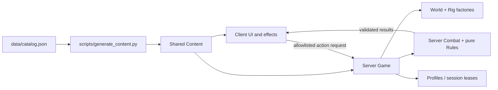

# Code map

## Files

- `data/catalog.json`: characters, styles, moves, source references, original balance numbers, location concepts, chronological chapter definitions, and unknowns.
- `src/shared/Content.luau`: generated catalog. `Config.luau`: runtime tuning. `Rules.luau`: pure admission, geometry, defense, profile validation, and lease transitions.
- `src/server/Game.luau`: network allowlist, player lifecycle, chapter/wave progression, arena rounds/scoring, saves and snapshots. `Bootstrap.server.luau` starts one session.
- `src/server/Combat.luau`: cast scheduling and cancellation, damage, shape/sight validation, dodge collision, guard/parry, statuses, NPC decisions, movement sanity checks.
- `src/server/World.luau`: deterministic hub/arena and private mission room construction. `Rig.luau`: original R6 models and weapon silhouettes.
- `src/server/Profiles.luau`: protected UpdateAsync load/save, session lease ownership, retry/fallback behavior, autosave integration and shutdown release.
- `src/client/UI.luau`: Journey, Characters, Techniques, Codex, Settings, health/energy HUD, cooldown cards, and notifications.
- `src/client/Effects.luau`: local bounded transient effect geometry. `Animator.luau`: local procedural Motor6D pose playback. `Bootstrap.client.luau`: camera, input and replication bindings.
- `tests/core.spec.luau`: portable rules/security/save tests. `tests/studio.spec.luau`: Roblox engine tests. `tests/multiplayer.*.luau`: isolated two-client integration tests.
- `scripts/check.py`: validation and build entry point. `scripts/prepare_studio_test.py`: temporary multiplayer test injection. `default.project.json`: Rojo service mapping.

## Network contract

`Network.Action` accepts Ready, Basic, Dodge, Guard, Skill, Select, Equip, Story, Arena and Hub. Skill payload contains a slot and facing direction. Equip contains a slot and owned move ID. No client-supplied damage, cooldown, target instance, currency, or progression is accepted. Requests consume a per-player token bucket.

`Network.State` carries player-specific snapshots at 5 Hz and sparse notifications. `Network.Effects` broadcasts compact cues; clients discard cues from distant rooms or different zones. Geometry, cooldowns and outcomes are server-controlled. Client-owned physics is checked for large movement anomalies; this is a basic safeguard and needs adversarial live testing before competitive release.

## Persistence

Save record: `{data = validatedProfile, lease = {token, expires}}`. UpdateAsync claims the lease on load, refreshes it on save, and releases it on departure. Writes fail closed on token mismatch. An unavailable store never permits fallback defaults to overwrite real progress. Overlapping saves are serialized within a server.

## Current mechanical abstractions

One active enemy per story wave. NPCs share a chase/attack decision loop with character-specific technique selection. Projectiles are telegraphed server line attacks. Summon forms are repeated projected fields, not autonomous minions. Style colors and weapon rigs vary; animation choreography is shared by pattern. These abstractions must be expanded for final canonical boss behavior and scene-quality animation.
